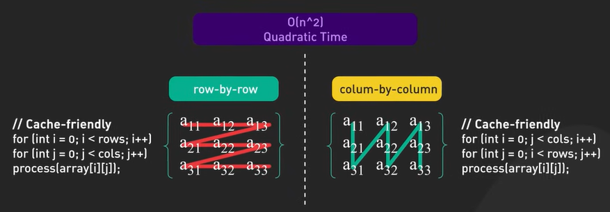

# Algorithms

Important algorithms used in software development.

## Main concepts

### Basics of Big O Notation - Complexity

Big O notation is just a start, in real-world performance can differ based on factors like caching, memory usage and hardware specification, for example maximizing cache hits with modern CPU can sometimes be more impactful that reducing algorithm complexity.

2 Examples:

1. **Array traversal**. Consider a 2d array - traversing it row by row is often faster than column by column, eventhough both are a quadratic time O(2^n).

Row wise axis maximizes sequantial memory access and is cache-friendly.

2. **Linked List vs Array**. Both are Linear Time O(n) complexity for traversal, but arrays often outperform linked list due to cache locality. Array elements are contiguous in memory, while linked list notes can be scattered.

#### Constant Time O(1)

Runtime stays the same regardless of input size. Array index Axis or hashtable operations are good examples.

#### Logarithmic Time O(log n)

Runtime increases slowly as input grows. Binary search is a classical example. Efficient for large datasets, doubling input size is just one more operation.

#### Linear Time O(n)

Runtime grows directly with input, like finding the maximum in an unsorted array if we must touch every element once.

#### Linearithmic Time O(n log n)

This is where efficient sorting algorithms live: merge sort, quick sort, heap sort are best possible for comparison based sorting.

#### Quadratic Time O(n^2)

Runtime grows with the square of the input size. Basic sorting algorithms like bubble sort belong here, iterating nested loops over the same data

#### Cubic Time O(n^3)

Runtime grows with the cube of input size. Three loops often indicate cubic time.

#### Exponential Time O(2^n)

Runtime doubles with each additional input element, can be found in some recursive algorithms, small inputs can take long time.

#### Factorial Time O(n!)

Runtime grows extremely fast with each input, permutations fits here inpractical for non-trivial input size.
