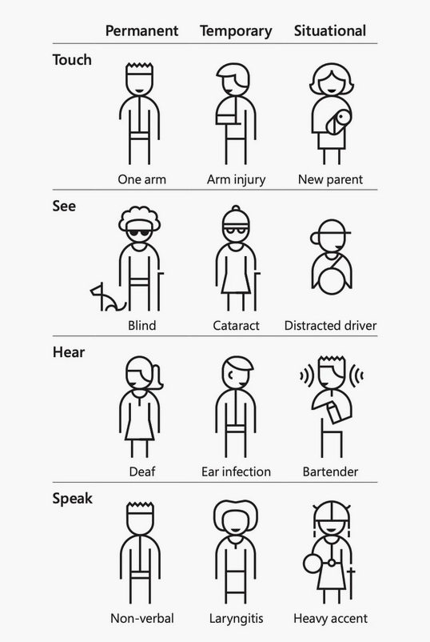

# Accessibility Testing

Inspired by [https://www.netguru.com/blog/accessibility-testing](https://www.netguru.com/blog/accessibility-testing)

[Web Content Accessibility Guidelines (WCAG) 2](https://www.w3.org/WAI/standards-guidelines/wcag/) is developed through the W3C process in cooperation with individuals and organizations around the world, with a goal of providing a single shared standard for web content accessibility that meets the needs of individuals, organizations, and governments internationally.

## Benefits of accessibility testing

Organizations are increasingly realizing that meeting digital accessibility standards is an opportunity to grow their business, show where they stand from an ethical perspective, and outshine the competition. How?

For starters, those who benefit from accessibility testing aren’t a negligible minority. Alongside the 15% of the population who experience some form of disability, there are temporary and situational impairments to consider, such as new parents, someone with an ear infection or laryngitis, people with heavy accents, and even those exposed to bright sunlight who [can’t see the screen on their mobile device properly](https://www.netguru.com/blog/mobile-accessibility-testing).

Source: [https://www.microsoft.com/design/inclusive](https://www.microsoft.com/design/inclusive)

As a side-effect there are other reasons how accesibility is important and affects the product:

- The customer and user experience improves for everyone, because accessible design makes navigation, text clarity, and appearance more user-friendly.
- People with disabilities tend to be loyal customers (as are their families) – by attracting long-term users you extend your market reach.
- Accessibility tests can reduce development costs, according to a Forrester Research Economic Impact Study commissioned by Microsoft.
- Because accessibility often enhances the digital experience for all users, loyalty and market share further increases.
- By keeping accessibility and formats like rich text in mind, SEO improves and it’s easier for search engines to find your website, potentially moving you up the rankings.
- Accessibility features often solve unanticipated problems, driving innovation in other areas.
- If done right from the outset, incorporating digital accessibility standards doesn’t add too much time to your web developers’ workloads.

There’s a strong business case for digital accessibility and an array of powerful case studies supporting that, spanning companies like Apple, Google, and Barclays.

## Accessibility audit vs. usability testing for accessibility

When an audit takes place, an accessibility specialist evaluates and validates your website against WCAG guidelines, highlighting accessibility issues and making recommendations around how to fix them.

Meanwhile, usability testing for accessibility involves people who use assistive technology in their everyday lives completing common tasks on your website or application; any issues they experience are investigated.

## Accessibility audit

An accessibility audit is a combination of manual and automated accessibility testing. The expert uses assistive technologies like screen readers and magnification software to perform the accessibility testing audit. They also use automated tools like WAVE and AXE to check page structure, low contrast, missing alt text, etc. A thorough accessibility audit provides full coverage that automated testing alone can’t offer.

During an audit, it’s important to differentiate between accessibility and usability: The two terms are quite different.

Website accessibility is all about ensuring the same access to information for everyone, and involves adhering to standards like WCAG. Meanwhile, the goal of usability is to deliver effective experiences for all users, including intuitive and seamless user interface design.
When to run an accessibility audit

The short answer is always! An accessibility audit is less expensive than usability testing for accessibility, and can uncover more accessibility issues, assuming your audit is carried out by an expert (who also keeps usability in mind).

## Tips on how to run an accessibility audit

- Identify templates. Before starting an audit, understand the mechanism you’re auditing. Find common patterns and pinpoint web pages that are built using the same template. By doing that, you avoid duplication of work.
- Prepare assistive technologies. Choose the products or systems you want to use – keyboards, screen readers, voice-overs, etc. These help you look at the website from a wider angle and identify accessibility issues.
- Create relevant documents. Prepare a spreadsheet with WCAG guidelines and a presentation template (if you need one), before you start your analysis.
- Start with what’s familiar to you. Explore the website as a user: Go through each page and look for problems that are visible at a glance.
- Explore the website with a WCAG list. Get familiar with the WCAG guidelines, find violations, and include them in your report. At Netguru, we use assistive technology to navigate and check the site.
- Use Web Inspector – a lot! That may seem overwhelming at first, especially if you’re not familiar with HTML and CSS. Do a course if you need to, because without basic knowledge of these languages, your accessibility report will be less valuable.
- Use automated web accessibility testing tools. There are a variety of resources that support auditing and testing for accessibility. Many are Chrome extensions, making them effortless to use.
- Double-check automated tools’ findings. Checking accessibility is NOT solely for a bot or a robot. Tools may report false information, highlight a different number of errors for the same product, or misunderstand accessibility requirements. Automated tools are a starting point, but not the only area you should focus on.
- Prioritize your findings. Give issues an impact and priority score – for example, high, medium, or minor. That makes it easier to identify which problems are the most important and helps you rank them correctly.
- Provide one recommendation per finding. At Netguru, when we carry out accessibility audits we want our customers to know exactly what action to take, so we only offer one best solution per issue.
- Summarize your thoughts in a report or presentation. In addition to providing a detailed description of your findings, also provide a summary of issues, recommendations, and next steps. Try to make your summary as actionable as possible and prioritize issues.

## Usability testing for accessibility

Accessibility audits don’t always catch every WCAG issue, and more than that, even if every WCAG issue is caught, that doesn’t mean the website is usable for people who need assistive technology.

There are various assistive technologies, many bespoke or tailored to specific situations, so it’s impossible to create accessible software by blindly following a set of rules. That’s why testing with people who actually rely on assistive technologies is such an important part of accessibility testing.

Accessibility-related usability improvements not only enhance the experience for people who need assistive technology, but they also raise usability levels across the board, for all users.
Differences between usability testing and usability testing for accessibility

Usability testing helps you understand how real people interact with digital products, and highlights features to add or improve. Usability testing for accessibility is about how users with disabilities and impairments interact with a website or app when they use assistive technologies.

In general, these two types of usability testing are more connected than most people think. For example, many pages and apps have text that's too small or bright, meaning you don't need a vision impairment to have issues reading it. Similarly, if there’s an error message but no way to close the pop-up, it will cause trouble to everyone, regardless of their abilities.

In general, you should invite people with disabilities or impairments to participate in every usability test, because products that are accessible are easy to use by everyone, not only people who need to use assistive technologies.

## Pros and cons of usability testing for accessibility

Because this type of accessibility testing involves real people, there’s a side benefit of uncovering general usability issues. Moreover, accessibility testing sessions are an excellent learning experience for team members and stakeholders, particularly if they watch the testing live.

That being said, as previously mentioned, usability testing for accessibility is expensive (when done properly). Why? It means recruiting at least five people who use assistive technology, meeting with them in surroundings that may need improvements for their comfort, and then running the test session.

Additionally, the testers often require testing apps or websites on their own devices. Clickable prototypes are created in Figma or Sketch and don’t support assistive technologies, so if you want to test new features, a prototype needs to be coded first, adding another cost. However, you’ll likely find different issues with usability testing, compared to accessibility audit.
When to run usability testing for accessibility

This type of accessibility testing is more expensive than an audit and harder to conduct, thus usability testing for accessibility is often skipped. But it’s a necessary step, ensuring your product can actually be used by people relying on assistive technologies.

We recommend carrying out an audit first. That way, you can highlight and fix compliance-related accessibility issues, before forging ahead with usability testing.

## Tips on how to run usability testing for accessibility

To optimize your usability testing for accessibility, there are three stages to consider:

1. Preparation

- Include people who use assistive technology in your user profiles and personas.
- Plan to conduct your test with real products or finished code.
- Adjust to people's needs and meet where it’s comfortable for them.
- Before a testing session, study the websites you’re testing to familiarise yourself.
- Make sure you’ve used the assistive technology before going to a testing session, so you can understand what the user is doing during the sessions.
- Prepare a script and practice it, to ensure all testers hear the same information.
- Conduct pilot tests for clarity, and expect to make changes as a result.

2. Before testing

- Get in touch with potential participants – they’re generally cautious but receptive.
- Prepare simple and standardized screening documents, so it’s quick and easy to recruit, schedule, or disqualify people.
- Ask users to sign a consent form, outlining things like how you’ll use the information you collect.
- Adapt the consent form to the needs of your participants: read it out loud, send a copy before the study, or offer Braille consent forms if needed.

3. During the test

- If speech synthesizers or computer speakers are being used, sit as close as possible so you know what’s going on.
- It may sound silly, but don’t be overly sensitive or act differently around testers.
- Evaluate your methods for responding to and encouraging participants, ensuring there’s not too much discussion and they concentrate on the task at hand – testing.
- For consistency, concisely read tasks aloud to all users.
- When taking pictures or a video, let participants know what you’ll use them for.
- Where possible, conduct studies at the user’s home or office, and let people use technology they’re familiar with – for example, their own screen readers or magnifiers.
