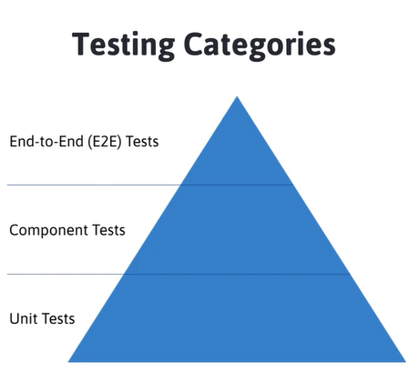

# Frontend Testing

## Testing principles

There are 3 main categories of testing:

Structure of software tests to ensure reliable, efficient, and scalable testing practices.
It provides a clear guideline on how to distribute different types of tests in a project to achieve high test coverage with minimal maintenance costs.

## Types of Testing

### Unit Test

Unit test is something when we instantiate the class on our own inside our test we're calling new class that we pass on the mocked version of dependencies and we test the class itself. No DOM interaction and no testbed(Angular), just basic individual units or functions in isolation, focusing on a small part of the code.

Example:

- helper function to transform value to display-friendly value
- validator function to check if email is valid

Characteristics:

- Fast to write and execute.
- High in volume, covering the majority of the codebase.
- Cheap to maintain since they only focus on a single unit of functionality.
- Ensure correctness of functions, methods, or classes in isolation from external dependencies.

### Component Test

Component test has a testbed(Angular), the DOM interaction, focuses on testing individual components (often UI components or logical groupings of code) and their interactions with other components or dependencies ensuring component behaves as expected when iteracting with surounded components or services.

Example:

- service layer interaction with a database
- component UI element event is triggered after button clicked and event was dispatched
- component loading state was dispatched and displayed correctly after loading completed

Characteristics:

- Slightly slower and more expensive than unit tests but faster than E2E tests.
- Can include testing at the component level (for example, React components) or the integration between different modules.
- Verifies that a set of units interact correctly, typically including some level of dependency (like services, databases, or APIs).

#### 4 Reasons Component Testing is Hard ( In Angular)

Mostly all reasons happen because of the need to handle manually processing which in application code are handled for us.

1. Configuration of testing module.
   Its something that we cannot just simply eliminate, we cannot automatize it, because we need to define which dependencies we want and do not want to mock. The complexity comes from Angular itself because we need to know about relationship of components, how services behave, what is it providing and other possible dependencies.

2. Asynchrony.
   In our test we have to know at which lines of code internally triggering asynchronous tasks because inside of our test we need to manage them, we need to use fakeAsync together with tick or similar approach where we acknowledge the existing async tasks running, run them now synchronously and then we continue.
   In the application code it works, but in tests we are the ones to manage it.

3. DOM Interaction.
   In application code it is handled and works fine, but it causes troubles in our tests depending on how many components we use in one particular test, because some components listen to DOM events to be triggered to work properly.

4. Change Detection.
   We have to trigger it manually `Fixture.detectChanges` otherwise the HTML or the DOM is not up-to-date.
   There is an option to set change detection automatically, but still it will not work on all situations.

#### Component testing vs Cypress component testing

Testing of components can be done in conventional way either using native methods or 3rd party libraries or with E2E tool like Cypress.

Component Tests:

- Can be tested in isolation
- We have precision & control
- Fast execution

* Requires TestBed Setup of all dependencies and other related components with their dependencies
* Requires to manage asynchrony
* Requires to manage change detection
* Requires to simulate DOM interaction

Component Tests with E2E

- Can be tested in isolation
- We have precision & control
- No asynchrony management
- No change detection management
- Great developer experience ( Browser feedback, screenshots, video recording, tasks/network stubbing)

* Requires major infrastructure
* Slow speed of execution

### End-to-End(E2E) Test

E2E Tests the entire application from the user's perspective by simulating real use cases, ensuring all parts of the system work together as intended.

Example:

- happy path of user login process, after login was navigated to the dashboard
- user in page A with a creation form filled it in correctly, submitted the data and after submitting is redirected correctly to page B and sees latest data as intended

Characteristics:

- Slow to run and costly to write and maintain because they test the entire stack, including UI, backend, databases, and third-party services.
- Less frequent but crucial for verifying critical user workflows (e.g., sign-up, purchase flow).
- Run against the complete, integrated system and often use browsers or automated tools to simulate user interactions.
