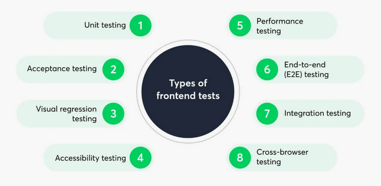

# Frontend Testing

To ensure that you stick to the best practices of frontend testing, you need a framework to follow. Luckily, you can use the F.I.R.S.T. principles for it.

F.I.R.S.T. principles stand for:

    Fast
    Isolated/Independent
    Repeatable
    Self-validating
    Thorough

Most of these are self-explanatory. Tests should be run speedily (at any necessary point of the life cycle), isolated from untested components, easily repeatable for the future, able to validate themselves whether the test has been passed and cover all necessary variables.
Failing test is a starting point where you have a test you need to pass.

Use real browsers and devices

Using real browsers and devices is an essential aspect of conducting error-free, reliable frontend tests which reflect the real-world environment as much as possible. Avoid using emulators and simulators and save time and resources by using real browsers and devices - this way, you will be able to rely on your software testing results much more.

Types of frontend tests

Since there are different elements to test for the frontend, there are a few different types of tests you can consider running. Each of these focuses on a different component of your frontend and together will ensure successful frontend testing for your application.

## Testing Pyramid

The testing pyramid is a framework to help development teams create high-quality software. It reduces the time needed for developers to identify any changes negatively impacting their code and supporting building reliable test suites.
It is sometimes referred to as the ‘ test automation pyramid’. It sets out the test types that you should include in automated testing and outlines what sequences and frequency these tests should follow. The aim is to provide immediate feedback, ensuring that code changes do not disrupt existing features.

There are 3 main categories of testing:

Structure of software tests to ensure reliable, efficient, and scalable testing practices.
It provides a clear guideline on how to distribute different types of tests in a project to achieve high test coverage with minimal maintenance costs.

## Types of Testing

### Unit Test

Unit testing is the fundamental building block of frontend testing. It analyzes individual components and functions to ensure they’re working as expected. This is crucial for any frontend application, testing your components and features against how you expect them to behave in production, leading to a stable codebase and a reliable app for your customers. You can also use unit testing for things like edge cases and testing APIs.

Unit test is something when we instantiate the class on our own inside our test we're calling new class that we pass on the mocked version of dependencies and we test the class itself. No DOM interaction and no testbed(Angular), just basic individual units or functions in isolation, focusing on a small part of the code.

Example:

- helper function to transform value to display-friendly value
- validator function to check if email is valid

Characteristics:

- Fast to write and execute.
- High in volume, covering the majority of the codebase.
- Cheap to maintain since they only focus on a single unit of functionality.
- Ensure correctness of functions, methods, or classes in isolation from external dependencies.

### Component Test

Component test has a testbed(Angular), the DOM interaction, focuses on testing individual components (often UI components or logical groupings of code) and their interactions with other components or dependencies ensuring component behaves as expected when iteracting with surounded components or services.

Example:

- service layer interaction with a database
- component UI element event is triggered after button clicked and event was dispatched
- component loading state was dispatched and displayed correctly after loading completed

Characteristics:

- Slightly slower and more expensive than unit tests but faster than E2E tests.
- Can include testing at the component level (for example, React components) or the integration between different modules.
- Verifies that a set of units interact correctly, typically including some level of dependency (like services, databases, or APIs).

#### 4 Reasons Component Testing is Hard ( In Angular)

Mostly all reasons happen because of the need to handle manually processing which in application code are handled for us.

1. Configuration of testing module.
   Its something that we cannot just simply eliminate, we cannot automatize it, because we need to define which dependencies we want and do not want to mock. The complexity comes from Angular itself because we need to know about relationship of components, how services behave, what is it providing and other possible dependencies.

2. Asynchrony.
   In our test we have to know at which lines of code internally triggering asynchronous tasks because inside of our test we need to manage them, we need to use fakeAsync together with tick or similar approach where we acknowledge the existing async tasks running, run them now synchronously and then we continue.
   In the application code it works, but in tests we are the ones to manage it.

3. DOM Interaction.
   In application code it is handled and works fine, but it causes troubles in our tests depending on how many components we use in one particular test, because some components listen to DOM events to be triggered to work properly.

4. Change Detection.
   We have to trigger it manually `Fixture.detectChanges` otherwise the HTML or the DOM is not up-to-date.
   There is an option to set change detection automatically, but still it will not work on all situations.

#### Component testing vs End-to-End component testing

Testing of components can be done in conventional way either using native methods or 3rd party libraries or with E2E tool like Cypress.

Component Tests:

- Can be tested in isolation
- We have precision & control
- Fast execution

* Requires TestBed Setup of all dependencies and other related components with their dependencies
* Requires to manage asynchrony
* Requires to manage change detection
* Requires to simulate DOM interaction

Component Tests with E2E

- Can be tested in isolation
- We have precision & control
- No asynchrony management
- No change detection management
- Great developer experience ( Browser feedback, screenshots, video recording, tasks/network stubbing)

* Requires major infrastructure
* Slow speed of execution

For more detailed comparison visit [https://www.netguru.com/blog/e2e-testing-vs-integration-testing](https://www.netguru.com/blog/e2e-testing-vs-integration-testing)

### End-to-End(E2E) Test

End-to-end testing is used to check and confirm that [the flow of the application](https://www.netguru.com/blog/e2e-testing-vs-integration-testing) works as expected from start to finish. It is mainly done by mimicking the actions of a real user within real-world scenarios to ensure smooth communication between the application’s interface and API is running smoothly. Doing so provides insight into the combined behavior of multiple system elements coupled together.

E2E Tests the entire application from the user's perspective by simulating real use cases, ensuring all parts of the system work together as intended.

Example:

- happy path of user login process, after login was navigated to the dashboard
- user in page A with a creation form filled it in correctly, submitted the data and after submitting is redirected correctly to page B and sees latest data as intended

Characteristics:

- Slow to run and costly to write and maintain because they test the entire stack, including UI, backend, databases, and third-party services.
- Less frequent but crucial for verifying critical user workflows (e.g., sign-up, purchase flow).
- Run against the complete, integrated system and often use browsers or automated tools to simulate user interactions.

### Acceptance testing

Acceptance testing is carried out to confirm that user inputs, user flows, and any designated actions on the frontend are coded and functioning properly. Development teams perform them to make sure the final model of the application works as it is expected to by end users.

### Visual regression testing

Visual regression testing is a uniquely frontend test. Other types of tests focus on code, and can therefore also be run for backend stacks. In turn, visual regression tests compare the actual/existing interface of your application with the corresponding ‘expected’ version to identify any gaps. This is achieved by comparing screenshots from a headless, server-run browser, and a machine is used to conduct image comparison between them, identifying and highlighting any differences.

### Accessibility testing

Accessibility testing checks if an application or website is [easily usable by every potential user](https://www.netguru.com/blog/accessibility-testing), including individuals with visual impairments or other additional needs. It is sometimes considered a subcategory of usability testing, and ensures that specific, unchangeable conditions don’t prevent anyone from accessing any of the features or functions of the app, and that they can navigate through the interface as easily as anybody else.

### Performance testing

[Performance testing analyzes your application’s performance](https://www.netguru.com/blog/performance-testing-tools) within specific parameters including speed, stability, scalability, interoperability and responsiveness. It is crucial to frontend testing as it helps to ensure that the product sustains its desired quality when the user load is increased, and it is fast and responsive to user requests and actions.

### Integration testing

Integration testing in frontend tests is a software testing approach that focuses on verifying the interactions and integration points between various components or modules of a web application's user interface. It ensures that these components work together seamlessly and can involve testing how different parts of the frontend (e.g., UI elements, APIs, and data sources) interact and behave in conjunction with each other, helping to identify issues such as data flow problems, communication errors, and functional integration problems.

### Cross-browser testing

Cross-browser testing is performed to confirm that an application works as expected in different web browsers. This process involves running the same set of test cases on different browsers to check that the application is compatible on each one. Because these tests are the same each time, this process can be automated.
