# Kafka

Created by LinkedIn, open-sourced under apache.
Resources:
[https://kafka.apache.org/documentation](https://kafka.apache.org/documentation).
[kafka architecture](https://www.youtube.com/watch?v=IsgRatCefVc).

Created to solve the problem of ingesting high volumes of event data with low latency.

Apache Kafka is an open-source distributed event streaming versatile platform used by thousands of companies for high-performance and real data pipelines, streaming analytics, data integration, and mission-critical applications at massive scale.

Kafka is a versatile platform that execls at scalable, real-time data streaming for modern architectures.
Its code queuing and messaging features power an array of critical applications and workloads.

## Principles

**Event streams** are organized into topics that are distributed across multiple servers called brokers. This ensures data is easily accessible and resilient to system crashes. Applications that feed data into Kafka are called **producers**, while those that consume data are called **consumers**.

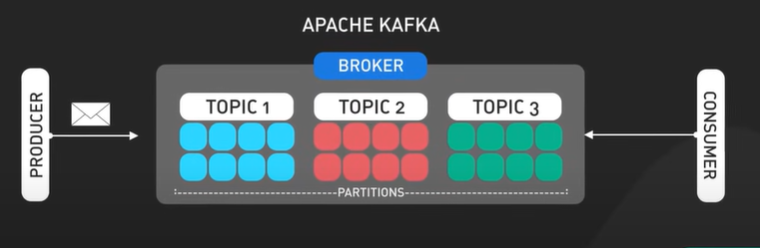

Kafka's strength lies in its ability to handle massive amounts of data, its flexibility to work with diverse applications, and its fault tolerance. This sets it apart simple messaging systems.
Kafka has become a critical component of modern system architectures due to its ability to enable real-time, scalable data streaming.

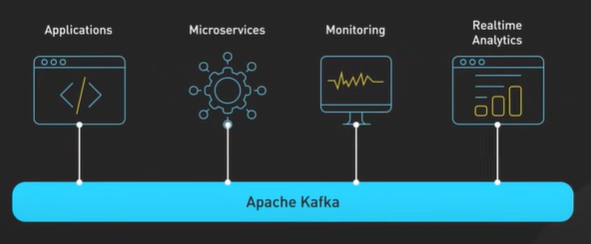

Most Common and impactful use cases:

1. Serves as a highly reliable, scalable message queue. It decouples data **producers** from data **consumers**, which allows them to operate independently and efficiently at scale.

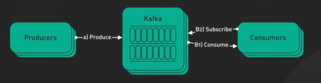

A major use case is **activity tracking**. Kafka is ideal for ingesting and storing real-time events like clicks, views and purchases from high traffic websites and applications.
Companies like Uber and Netflix use Kafka for real-time analytics of user activity.

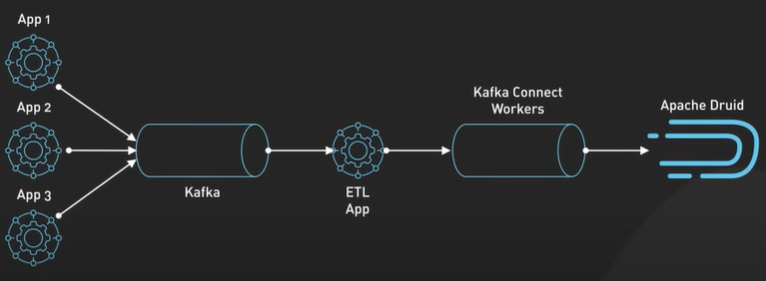

2. For **gathering data** from many sources, Kafka can consolidate disparate streams into unified real-time pipelines for analytics and storage. This is extremely useful for aggregating internet of things and sensor data. (Search engine, analytics, web & mobile apps, databases, data warehouses/lakes)

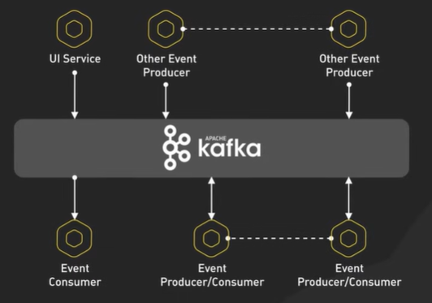

3. In the microservices architecture kafka serves as a **data bus** that allows differnet services to talk to each other.

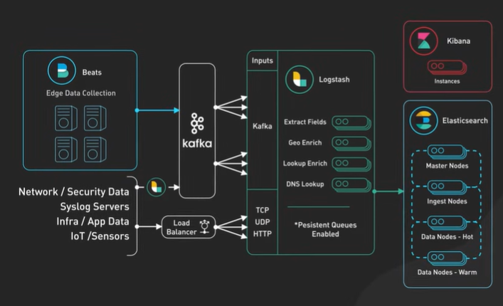

4. Great for **monitoring** and **observability** when integrated with the ELK stack. It collects metrics, application logs and network data in real-time which can then be aggregated and analyzed to monitor overall system health and performance.

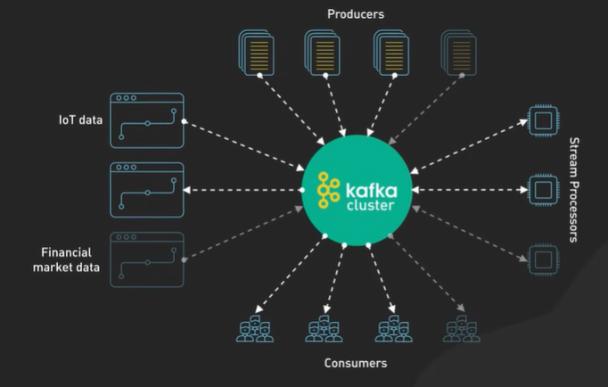

5. Enables **scalable stream processing** of big data through its **distributed architecture**. It can handle massive volume of real-time data streams. For example, processing user click streams for product recommendations, detecting anomalies in IoT sensor data, or analyzing financial market data.

## Limitations

Limitations are that:

- Kafka is quite complicated and has a steep learning curve.
- It requires some expertise for setup, scaling, and maintenance.
- It can be quite resource- intensive, requiring substantial hardware and operational investment. This might not be ideal for smaller startups or not suitable for ultra-low-latency applications like high frequency trading, where microseconds matter.

## Features

### Core Capabilities

- High Throughput. Deliver messages at network limited throughput using a cluster of machines with latencies as low as 2ms.

- Scalable. Scale production clusters up to a thousand brokers, trillions of messages per day, petabytes of data, hundreds of thousands of partitions. Elastically expand and contract storage and processing.

- Permanent storage. Store streams of data safely in a distributed, durable, fault-tolerant cluster.

- High Availability. Stretch clusters efficiently over availability zones or connect separate clusters across geographic regions.

### Ecosystem

- Built-in Stream Processing. Process streams of events with joins, aggregations, filters, transformations, and more, using event-time and exactly-once processing.

- Connect To Almost Anything. Kafka’s out-of-the-box Connect interface integrates with hundreds of event sources and event sinks including Postgres, JMS, Elasticsearch, AWS S3, and more.

- Client Libraries. Read, write, and process streams of events in a vast array of programming languages.

- Large Ecosystem Open Source Tools. Leverage a vast array of community-driven tooling.

## Components and Lifecycle

### Kafka Message

Event stream == Message == Record == Data.
Consists of key, value timestamp, headers(optional), partition and Offset Id.

<pre>
 key: "John",
 value: "Added iphone to the cart",
 timestamp: "2024-11-12T16:59:23",
 systemId: "1234" // Headers
 // Partition and Offset Id added once message is written to topic
 </pre>

Data formats can be

- String,
- JSON,
- Protobuf(twice less size than JSON, common practice),
- Avro

Message lifecycle:

- Application(Kafka producer)
- Serializer(encodes to store in topic)
- Topic(stores message)
- Deserializer(decodes for consumer)
- Application(Kafka consumer)

Best practice for choose the Key of the message is "NULL" to have auto ordering and messages for the consumer will arrive in order by automatically loadbalancing across all partitions. Kafka only guarantees to preserve the order in the same partition. **Same Key id** for message and topic could be used and **default partitioner**, but would introduce issues for scalling introducing **underutilized partitions**. For example important case of message status id could be **"prepared", "shipped", "delivered"**

### Topic

Before we can publish any message to Kafka, we need Kafka Topic.

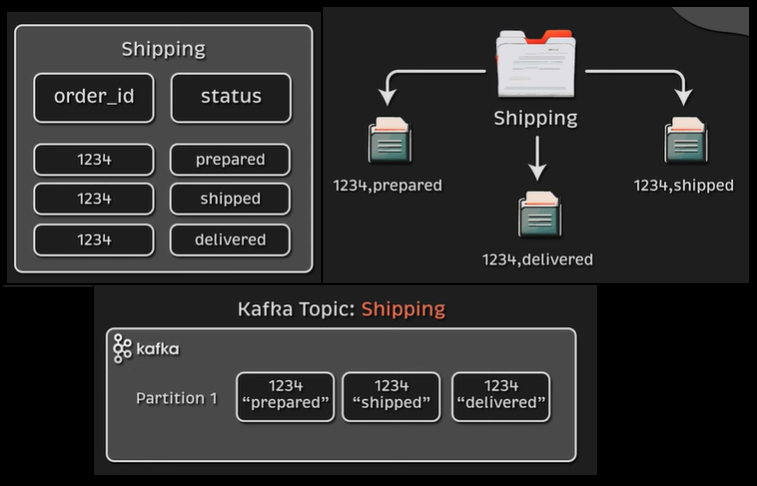

We can think of it as a database table where each message represents a record.
Or as a folder in a filesystem with messages representing a file.

Kafka Topics are always multi-producer and multi-consumer. Meaning, producers can simultaniously write to the same topic and same applies to the consumers.
Unlike traditional messaging systems, messages are not deleted after consumption. Instead each Topic has its own retention period either 1 minute or 1 week after which Kafka deletes those messages. Performance is constans with respect to data size - storing data for long time is perfectly fine.
We can scale topics horizontally well beyond a single kafka topic, simply by increasing the number of partitions in the topic and increasing paralelism.

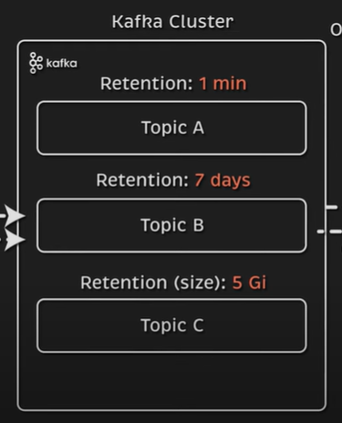

### Partision

Kafka's foundation is built around partision which is fast. Topic is a higher level abstraction that consists of partitions. Partition itself is a discreet **log file** written to that local kafka **broker**.
Topic can be spread in multiple kafka brokers, but partition belongs to a single broker. We can scale our topic to 9 partitions across 3 kafka brokers in this way we are not limited to 1 specific brokers Input/Output. If we need to handle millions of messages per second, it's not a big deal for kafka just to scale the number of partitions and increase the number of consumers.

In many cases, we want to scale our application to the same number of partitions, for instance, when we have 9 partitions, we can set the replica count for our application to 9 as well. Beyond that point, our replicates would read from the same partitions which could be a bottleneck. In that case, we would need to scale the partitions first and then the application.

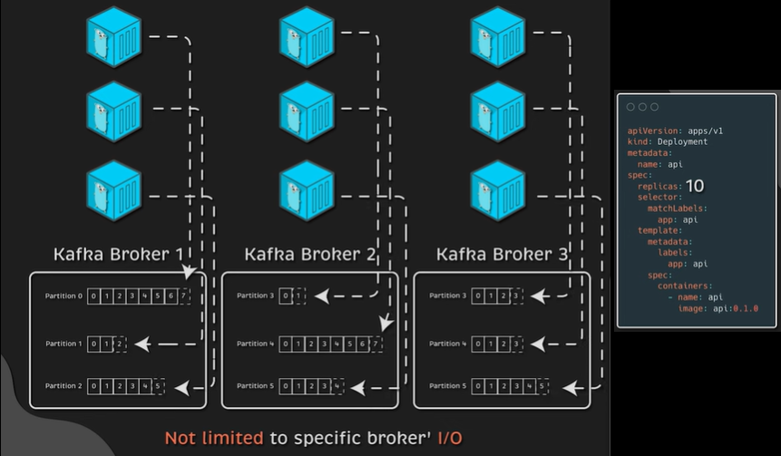

When a new message is written to a topic, Kafka adds it to one of the topic's partitions. Messages with the same key(ex: customerId) are published to the same partition. Kafka ensures that any reader of a given partition consumes messages in the order they were published.

Kafka can **replicate partitions across different brokers**. The best practice is to set replication to 3.
We would have a producer that directly writes to a specific broker partition and then the Kafka cluster automatically replicates that data across 2 different brokers. We call the original partition a **partition leader**. Keep in mind that both the **producer** and **consumer** write to and consume from the partition leader.

If the broker would fail, the Kafka controller reassigns the leader for that partition to a different broker and redirects producers and consumers to use a different broker.

With 9 partitions of replication factor of 3, we get 27 partitions spread acorss different brokers. Thats why Kafak is **fault-tolerant** and with **high-availability** meaning, after failure we will be able to continue writing and reading data without any interruption.

### Producer

Client application that publish(write) events to Kafka, also known as **publishers** or **writers**.
Distribute data to topics by selecting the appropriate partition within the topic.

They allocate messages sequentially to the topic partition, typically, the producer distributes messages across all partitions of a topic, but producer may direct messages to a particular partition in certain instances. For example - keep related events together in the same partition and in the exact order in which they were sent.
The producer can also use a customized partitioner to map messages to partitions based on specific business logic. Also, should take care distributing keys around evenly across partitions to avoid sending too much traffic to one particular broker, which could effect performance.

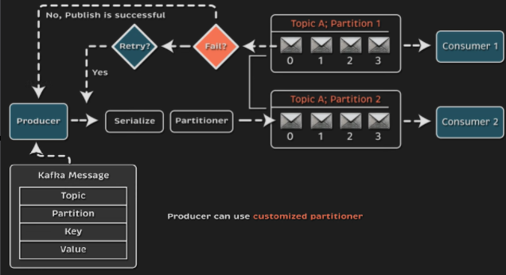

### Consumer

Application which subscribe to **topics** and **process published messages**, also refered to as **subscribers** or **readers**. Reads the messages in the order they were generated, using **offset** to track which message it has already consumed.
The consumer stores the offset of the last consumed message for each partition so that it can stop and restart without losing its place. Consumers interact with a topic as a group, although a group consists of only one consumer.
This enables scalable processing. The group ensures that one member only consumes each partition, if a single consumer fails, the group's remaining members reorganize the consumed partitions to compensate for the absent member.

### Cluster

Kafka is a distributed System consisting of multiple servers. At the very core of the Kafka cluster are its brokers, the fundamental units responsible for storing and managing data streams.
Each broker receives a specific data partition, which it stores and serves upon request. The data partition ensures proper distribution and reduces the chances of redundancy. Moreover, as the data increases, more brokers can be added to increase scalability.

Metadata is another essential component in the operation of Kafka clusters. It provides information about topics, brokers, partitions, consumer groups, and their communication. The metadata enables Kafka to make effective decisions regarding the distribution, replication, and consumption of data streams.

#### Single cluster

As the name suggests, it is a single Kafka cluster with centralized management.

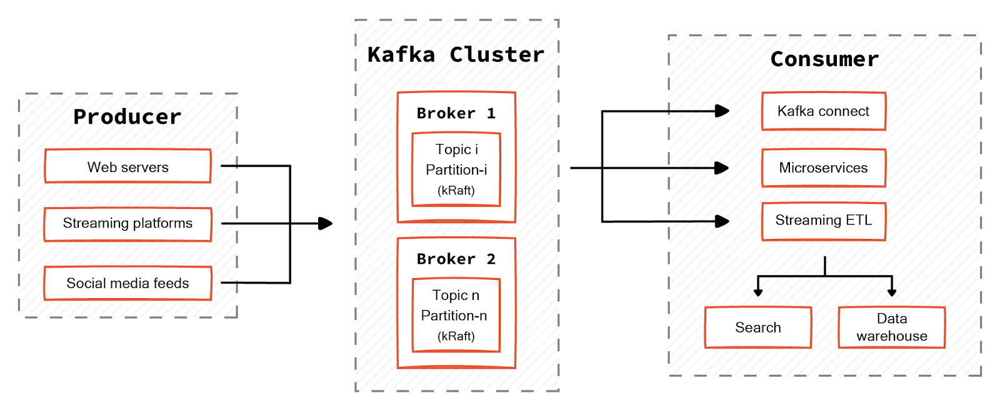

A single Kafka cluster has the same underlying infrastructure as a simpler Kafka setup with identical components and principles. As shown in the above diagram, a single Kafka cluster allows you to deploy all components under a single unit. This includes:

- All the brokers responsible for storing and serving data.
- All the metadata management through the KRaft protocol, and
- The topics partitioned and replicated across these brokers.

Client applications can interact with these brokers to produce and consume messages as required.

#### Multiple clusters

A multiple Kafka cluster setup is a decentralized approach involving separate clusters for different workloads. Workload segregation reduces interference between multiple resources and mitigates deadlocks. You can scale each Kafka cluster independently based on workload demands.

There are multiple models for multi-Kafka cluster deployment.

##### Stretched cluster

A stretched cluster is a single logical cluster stretched over multiple geological locations. Developers distribute replicas of the cluster evenly across the data centers, increasing redundancy and fault tolerance in the face of failure.

##### Active-active cluster

An active-active cluster is the preferred model, allowing two homogeneous clusters to have bi-directional, asynchronous mirroring. This mirroring is established through a [MirrorMaker](https://redpanda.com/guides/kafka-alternatives/kafka-mirrormaker) that uses a Kafka consumer to read messages from the source cluster. This consumer republishes them to the target cluster through an embedded Kafka producer.

This model is the most used as the client application does not have to wait until the mirroring completes across multiple clusters. Although there will be distinct Kafka producers and consumers on each cluster, the data from both clusters will be available on each cluster due to the mirroring process.

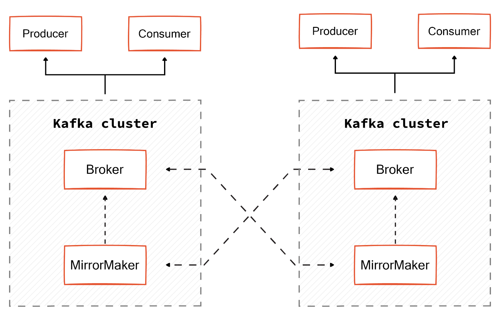

More on [Kafka Cluster Architecture](https://www.redpanda.com/guides/kafka-architecture-kafka-cluster)

_Traditionally, Kafka relied on Zookeeper to elect a Kafka controller, maintain cluster membership, manage topic configurations, and perform some other functions. ZooKeeper is also a distributed system, and in production environments we would also be required to deploy and maintain a 3 or 5 node cluster. This adds additional complexity an increases the maintenance for the cluster. Recently, Kafka received an update that allowed it to run the cluster without Zookeper at all. It's called KRaft mode, and it's production-ready as of version 3.3. This update not only removed Zookeeper but also increase the efficiency and reduced the latency of Kafka in general. Being new to Kafka and not having any legacy applications, suggestion is to use latest deployment option._

### Broker

Single kafka server which receives messages from **producers**, assign them offsets, and commit the messages to disk storage. An **Offset** is a unique INT value that Kafka increments and adds to each message as it's published.
Offsets are unique for each partition and are **critical** for **maintaining data consistency** in the event of a failure or outage.

For example, if the consumer fails and when it's restarted, it will return to the last-consumed message. Atleast, that's the default behavior.

Since Kafka writes every single message to the local disk, to increase performance, make sure to attach fast SSD disks to Kafka brokers.

### Controller

Every Kafka cluster has a single active Kafka controller. It is responsible for managing partitions and replicas and performing some administrative tasks, such as reassigning partitions.

For example, if one kafka broker goes down with the partition leader, the active controller will reassign this function to another broker that already has all the replicated data to act as a partition leader and serve data.

The controller service runs on every broker in a Kafka cluster, but only one broker can be active(elected) at any point in time. _it used to be managed and elected by Zookeeper, but in the new version, it is elected internally using the Raft protocol._
